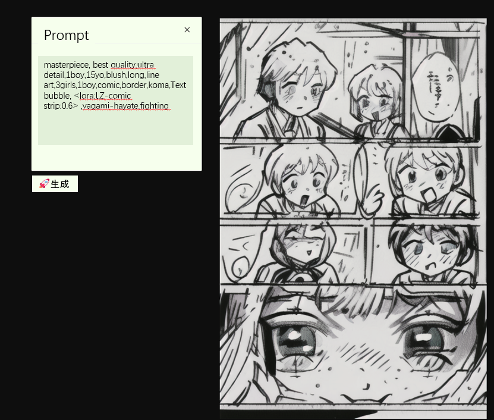
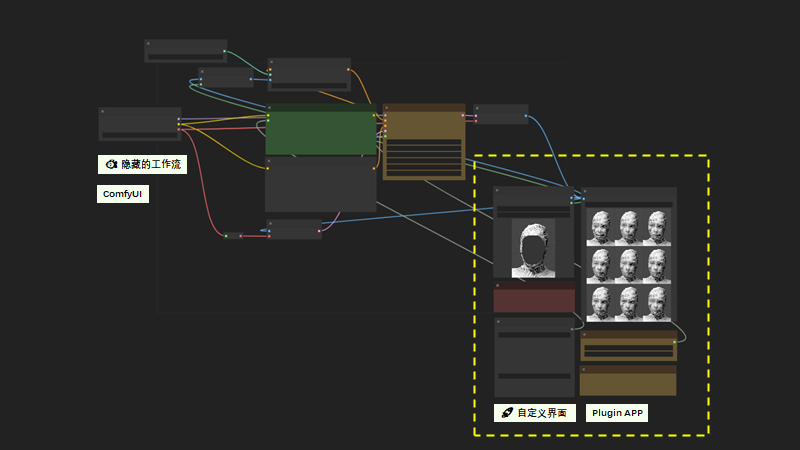

# plugins

!!!!Undergoing, not completed

Plugins: Turn any ComfyUI workflow into an application

Comfyui provides an editor and backend services, but lacks a user interface for end users. When creators have created their own workflow, they need to open the same interface again for the next use, and unnecessary features (or nodes) cannot be hidden. Similar to a game engine, after creating a game in the editor, it needs to be packaged into a user-friendly interactive interface.

Plugins are designed based on this idea to provide an interactive interface for ComfyUI applications.

*Comfyui
- Backend, editor
- Export workflow.json file

*Plugins
- Packaging and debugging features
- Interactive interface

@进行ing，未完成

Plugins：把任意comfyUI的工作流变成一个应用

Comfyui提供了编辑器、后端服务，缺少了一个使用端。
当创作者创建了属于自己的工作流之后，下一次使用还需要同样的界面打开，其他不需要的功能（或者节点）无法隐藏。
类似于游戏引擎，在编辑器里制作好游戏之后，需要打包成一个用户友好的交互界面使用。

Plugins就是按照这个思路设计的，提供comfyui应用的交互界面。

*Comfyui
- 后端、编辑器
- 导出workflow.json文件

*Plugins
- 打包调试功能
- 交互界面

## workflow plugin 开发
见demo-plugin

## server
本机开启web服务

TODO:
- 需要验证nodes是否有效
- 
https://github.com/Kagami/ffmpeg.js

- sharp 安装不成功