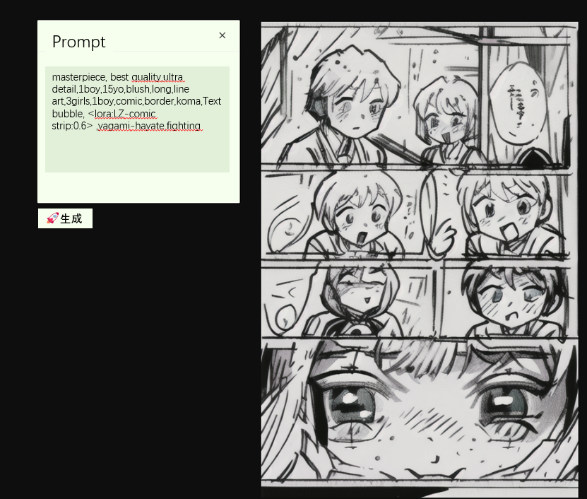

@进行ing，未完成

[english](./README.md)

Plugins：把任意comfyUI的工作流变成一个应用

Comfyui提供了编辑器、后端服务，缺少了一个使用端。
当创作者创建了属于自己的工作流之后，下一次使用还需要同样的界面打开，其他不需要的功能（或者节点）无法隐藏。
类似于游戏引擎，在编辑器里制作好游戏之后，需要打包成一个用户友好的交互界面使用。

Plugins就是按照这个思路设计的，提供comfyui应用的交互界面。

*Comfyui
- 后端、编辑器
- 导出workflow.json文件

*Plugins
- 打包调试功能
- 交互界面

## workflow plugin 开发
见demo-plugin

## 案例
> 实时设计，基于LCM-Lora的实时图像设计工具，使用白板工具，得到实时修改的图像结果。

https://github.com/shadowcz007/comfyui-plugins/assets/12645064/4a8e3e7f-7e9e-4525-855b-f1316ec06f3c

TODO:
- 需要验证nodes是否有效
- [ffmpeg](https://github.com/Kagami/ffmpeg.js)
- sharp 安装不成功